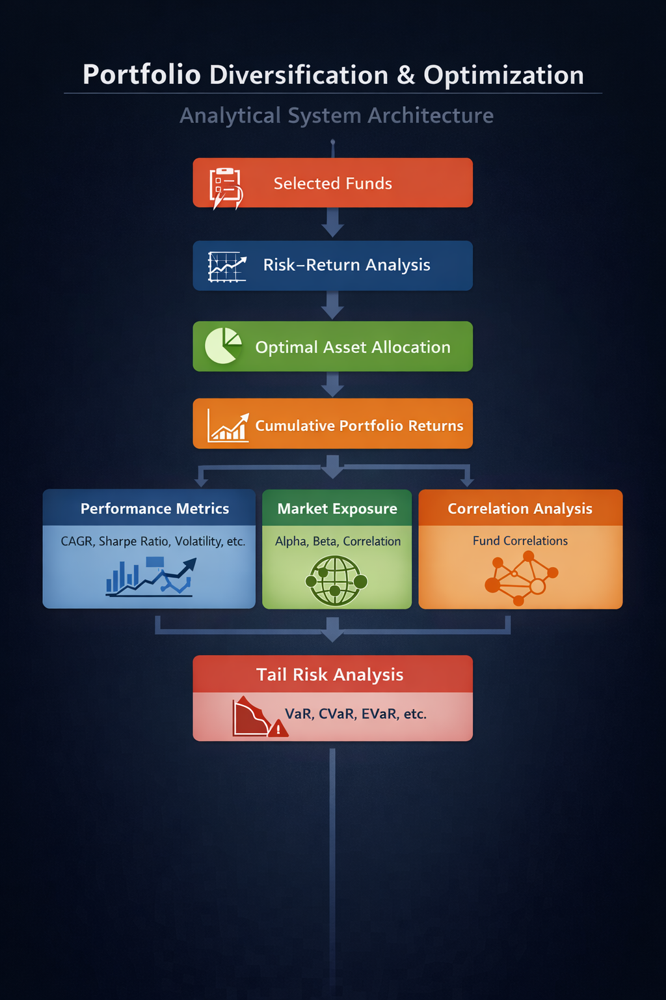
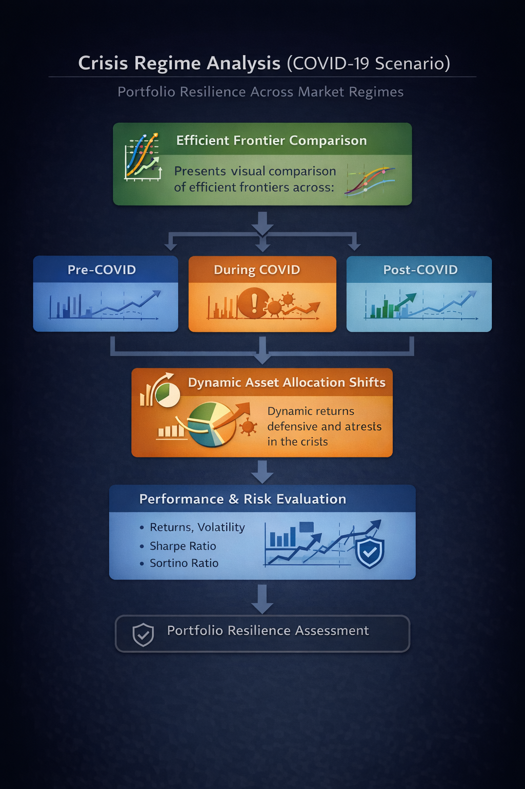

# 🏦 Multi-Asset Portfolio Analytics, Diversification & Optimization  
> A statistical decision-support model for smarter investing
## 🚀 **Live Demo**
👉 **[Click here to try the app](https://mutual-fund-portfolio-analytics.streamlit.app/)**
> This dashboard analyzes **portfolio performance** across **multiple investment strategies** and **market conditions**, including the **COVID-19 crisis**, helping investors understand how their portfolio behaves during **market stress** and make **confident, data-driven investment decisions**.


## 📌 Project Overview

This project develops an **interactive portfolio analytics dashboard** designed to help investors **systematically evaluate how their mutual fund portfolio changes when a new fund or asset class is added**.

The primary goal is to **quantify risk–return trade-offs**, **measure true diversification benefits**, and **identify portfolio efficiency improvements**, enabling investors to make **data-driven allocation decisions** instead of relying solely on intuition or historical performance.

By comparing portfolio behavior **before and after fund inclusion**, the system reveals whether a new investment:
- ✅ Improves **risk-adjusted returns**
- 🧩 Adds **meaningful diversification**
- ⚠️ Or increases risk without sufficient return compensation

The dashboard serves as a **statistical decision-support framework**, translating complex portfolio theory and risk metrics into **clear, actionable insights** that help investors build **optimized, diversified, and resilient portfolios** aligned with their risk appetite and investment goals.
## 📊 Dataset

This analysis is designed to deliver **research-backed insights with global relevance**, while validating the **consistency and robustness of portfolio behavior** across different economic cycles and market environments.

To ensure broad coverage and analytical reliability, the study spans **multiple geographies**, including:
- 🇺🇸 United States  
- 🇮🇳 India  
- 🇪🇺 Europe  

The analysis is conducted using a **9-year historical dataset**, covering the period from **March 2016 to April 2025** for each selected fund, allowing for evaluation across multiple market phases.

---

## 🎯 Portfolio Construction Objective

The primary objective is to construct and evaluate **well-diversified multi-asset portfolios** using a comprehensive set of investment instruments:

- **Traditional Equity Funds**  
  (Large-cap, Mid-cap, Small-cap, and Index Funds)
- **Bond Funds**
- **ESG-focused Funds**
- **Commodity Funds**

Multiple funds are selected within each asset category to ensure a **representative and unbiased analysis**. All funds are **systematically classified by country and asset class**, and can be explored using **interactive dashboard filters** for detailed, comparative evaluation.

---

## 🔍 Research Focus

The inclusion of **ESG-focused funds** enables a deeper assessment of how sustainability-oriented investments influence overall portfolio performance. Specifically, this analysis helps investors to:

- Mitigate **long-term sustainability and regulatory risks**
- Gain exposure to companies with **strong governance and responsible business practices**
- Achieve **competitive risk-adjusted returns** while aligning investments with ethical and environmental objectives

The findings demonstrate that ESG funds can **effectively complement traditional asset classes**, enhancing portfolio resilience without compromising return potential.

---

Overall, this research provides a **structured, data-driven framework** that enables investors to build **balanced, resilient, and future-ready portfolios**, aligned with both **financial goals and long-term sustainability preferences**.

# Documentation

👉 [Click here for Documentation](https://github.com/sagar352002/multi-asset--portfolio-analytics/blob/main/Portfolio%20research%20paper%20report.pdf)

# 📊 Portfolio Analytics & Risk Evaluation Framework

The dashboard is structured into **two primary analytical tabs**, each designed to address a specific portfolio evaluation objective.

---

## 1️⃣ Portfolio Diversification & Optimization

This tab focuses on **portfolio construction, diversification strength, and risk–return efficiency**.  
As users select multiple funds through the interactive filters, the dashboard dynamically generates the following analyses:

- **Fund Overview**  
  Displays selected fund names along with their key characteristics.

- **Individual Risk–Return Analysis**  
  Visualizes the standalone risk–return profile of each fund to assess relative performance and risk contribution.

- **Asset Allocation (Portfolio Theory–Based)**  
  Presents **optimal portfolio weights** derived using modern portfolio theory, highlighting efficient capital allocation across selected funds.

- **Cumulative Portfolio Returns**  
  Shows cumulative portfolio performance, enabling **comparative analysis** across different fund combinations.

- **Statistical Performance Metrics**  
  Provides comprehensive portfolio-level metrics, including:
  - Compound Annual Growth Rate (CAGR)  
  - Rolling Returns  
  - Volatility  
  - Sharpe Ratio  
  - Sortino Ratio  
  - Omega Ratio  
  - Maximum Drawdown  

- **Market Exposure & Diversification Metrics**  
  Evaluates portfolio sensitivity and diversification using:
  - **Alpha** (excess return over benchmark)  
  - **Beta** (market sensitivity)  
  - **Average inter-fund correlation**  

- **Correlation Analysis**  
  Examines inter-fund correlations to identify **diversification benefits, clustering effects, and concentration risks**.

- **Tail Risk & Downside Risk Analysis**  
  Assesses portfolio behavior under extreme market conditions using advanced risk measures:
  - Value at Risk (VaR)  
  - Conditional Value at Risk (CVaR)  
  - Entropic Value at Risk (EVaR)  
  - Skewness and Kurtosis  
  - Stress CVaR  
  - Downside Deviation  
  - Expected Shortfall Ratio (ES Ratio)  

---



This framework enables investors to evaluate portfolios beyond average returns by incorporating **diversification quality, market exposure, and downside risk**, supporting **robust and resilient portfolio construction** across market cycles.


---

## 2️⃣ Crisis Regime Analysis (COVID-19 Scenario)

This tab evaluates portfolio performance across **distinct market regimes**, with a dedicated focus on the **COVID-19 market shock**, to assess portfolio robustness and adaptability under extreme stress conditions.

### Key Analytical Components

- **Efficient Frontier Comparison**  
  Provides a visual comparison of portfolio efficient frontiers across three market phases:
  - **Pre-COVID Period (2016–2018)** – Stable market conditions with conventional risk–return dynamics  
  - **COVID Crisis Period (2019–2020)** – Heightened volatility and compressed risk–return efficiency  
  - **Post-COVID Recovery Period (2021–2022)** – Gradual restoration of portfolio efficiency and improved risk-adjusted returns  

  This analysis clearly illustrates how portfolios **lost efficiency during the crisis** and **recovered in the post-COVID phase**, reflecting improved return potential for a given level of risk.

- **Dynamic Asset Allocation Shifts**  
  Examines how optimal portfolio weights evolved across regimes, highlighting a shift from **equity-heavy allocations toward defensive and debt-oriented assets** during the crisis, followed by a **rebalancing toward growth assets** in the recovery phase.

- **Performance and Risk Evaluation Across Regimes**  
  Compares portfolio performance and risk metrics—including returns, volatility, and risk-adjusted measures—across market phases to evaluate **portfolio resilience, drawdown behavior, and recovery strength**.

---




Together, the diversification and crisis-regime modules form a **holistic, regime-aware portfolio evaluation framework**, enabling investors to:

- Understand how diversification enhances portfolio efficiency  
- Evaluate portfolio behavior during periods of extreme market stress  
- Observe how optimal asset allocations adapt and recover across economic cycles  

This approach supports **data-driven, resilient portfolio construction**, aligned with long-term investment objectives and disciplined risk management principles.
# 🚀 Run Locally (Windows)

Follow the steps below to set up and run the application on a Windows system:

1. **Download the Repository**
   - Download the project as a ZIP file and extract it into a new folder.

2. **Open the Project**
   - Open the extracted project folder in **Visual Studio Code** (or any preferred code editor).

3. **Create a Virtual Environment**
   ```bash
   python -m venv venv
4. **Activate the Virtual Environment**
    ```
    venv\Scripts\activate
5. **Install Project Dependencies**
    ```bash
    pip install -r requirements.txt
6. **Run the Application**
    ````bash
    streamlit run app.py

## 🎓 Skills Demonstrated

`Portfolio Theory` `Risk Management` `Python` `Data Analytics` `Financial Modeling` `Statistical Optimization` `Interactive Dashboards` `Quantitative Finance` `ESG Analysis` `Crisis Modeling`

---


## 📖 Acknowledgement

This project draws upon insights from **peer-reviewed research published in leading academic journals**.  
I gratefully acknowledge the following studies, which have directly shaped the **methodology, risk modeling approach, and portfolio evaluation framework** used in this project.

- **Mandal, P. K. (2024).** *Review: Higher-order moments in portfolio selection problems.*  
  https://www.sciencedirect.com/science/article/abs/pii/S0957417423021279  

- **Do green financial markets offset the risk of cryptocurrencies and carbon markets?**  
  https://www.sciencedirect.com/science/article/abs/pii/S1059056023001211  

- **Risk-return performance of optimized ESG equity portfolios in the NYSE**  
  https://www.sciencedirect.com/science/article/pii/S1544612322004895  

- **Portfolio optimization with entropic value-at-risk**  
  https://linkinghub.elsevier.com/retrieve/pii/S0377221719301183  

- **Revisiting the accuracy of standard VaR methods for risk assessment**  
  https://www.sciencedirect.com/science/article/abs/pii/S1062976920301150  

- **Do green investments improve portfolio diversification?**  
  https://linkinghub.elsevier.com/retrieve/pii/S105752192400187X  

- **Integrating ESG risks into value-at-risk**  
  https://www.sciencedirect.com/science/article/pii/S1544612323002477  

- **ESG factors and risk-adjusted performance: A quantitative approach**  
  https://www.tandfonline.com/doi/full/10.1080/20430795.2016.1234909  

These studies enhanced the **analytical depth, robustness, and practical relevance** of this portfolio analytics project. Their contributions are sincerely acknowledged.


## 📫 Connect

**Questions or collaboration opportunities?** Feel free to reach out!

⭐ **Star this repo** if you find it valuable for portfolio analytics!
